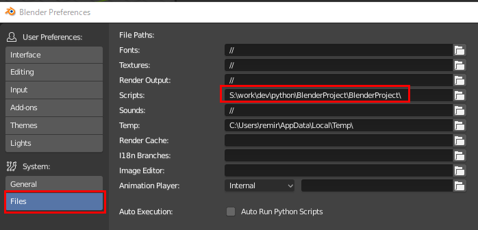
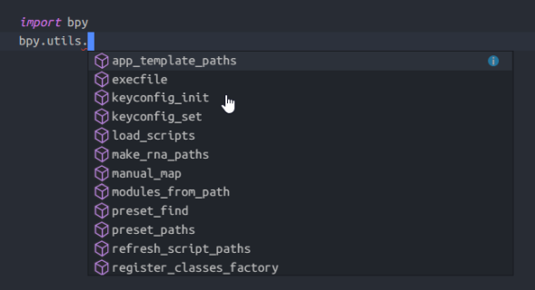

# Blender の開発環境を作る

tags: tag1, tag2

## 開発用スクリプトのフォルダを追加する

通常のプラグインのインストールフォルダは  
**C:\Users\<User>\AppData\Roaming\Blender Foundation\Blender\2.80\scripts\addons**  
このフォルダ下になるが、この下に開発用のコードも置いてしまうのはイヤなので、  
別の Scripts フォルダを設定する。



Preferences の Files 下の「Scripts」に、スクリプトの作業フォルダを設定する。


自分の場合は、pipenv でプロジェクトを作成しているので、基本構造は ↑ のようになります。  
Scripts で指定した Path は、各種スクリプトの Root フォルダになっているので  
Blender で読み込む Addon は、  
**addons フォルダ下に保存しないと、Addon リストには表示されない** ので注意。

実際の Blender の Addon は .py 単体か、  
あるいはフォルダに **init**.py を作成し、  
その中に Addon の基本構造が書かれているかのいずれかで作成する。

## VSCode で AutoComplete できるようにする

VSCode でコーディングするのに、AutoComplete がないのは不便なので設定をする。

```json
{
  "settings": {
    "python.pythonPath": "<Blender_Folder>\\2.80\\python\\bin\\python",
    "python.autoComplete.extraPaths": [
      "<Blender_Folder>\\2.80\\scripts\\modules"
    ]
  }
}
```

pythonPath は、 python/bin/python  
あとは、bpy モジュールのパスを **python.autoComplete.extraPaths** に追加する。



パスを登録して VSCode を再起動すると、↑ のように予測変換が表示される。

## 参考

- [blender-debugger-for-vscode](https://github.com/AlansCodeLog/blender-debugger-for-vscode)
