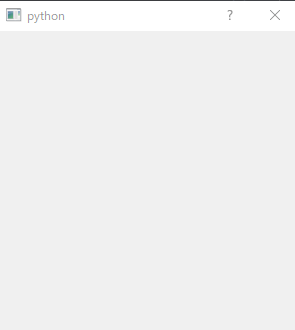

#PySide の RubberBand(選択範囲表示)の使い方

```python
# -*- coding: utf-8 -*-

 import sys
 from PySide import QtCore, QtGui


 class RubberBandTest(QtGui.QDialog):

     rubber_band = None

     def __init__(self, parent=None):
         super(RubberBandTest, self).__init__(parent)

         self.resize(300, 300)

     def mousePressEvent(self, e):

         self.origin = e.pos()
         if not self.rubber_band:
             self.rubber_band = QtGui.QRubberBand(QtGui.QRubberBand.Rectangle, self)
             self.rubber_band.setGeometry(QtCore.QRect(self.origin, e.pos()).normalized())
             self.rubber_band.show()

     def mouseMoveEvent(self, e):

         self.rubber_band.setGeometry(QtCore.QRect(self.origin, e.pos()).normalized())

     def mouseReleaseEvent(self, e):

         self.rubber_band.hide()
         self.rubber_band = None


 if __name__ == '__main__':
     app = QtGui.QApplication(sys.argv)
     a = RubberBandTest()
     a.show()
     sys.exit(app.exec_())
```



選択範囲をわかりやすく表示できるのが、RubberBand。  
このような動作は、paintEvent などでも作成できるが、RubberBand を使用した方が圧倒的に楽に  
作成することができる。
