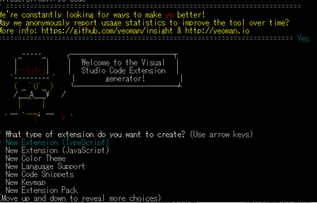
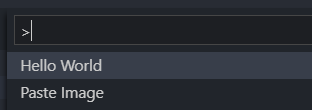

# VSCode の拡張機能を作る

VSCode の拡張は TypeScript で作成する。

## 下準備

まず、Extension の基本的な構造を作るための準備をする。

```
npm install -g yo generator-code
yo code
```

npm を使用して、コマンドをインストール。
yo code で、実行できる。



プロジェクトを作成するルートフォルダに移動し、  
移動先で **yo code** を実行すると、選択する Extension タイプがきかれるので、  
**「New Extension（TypeScript）」**を選択する。


その後、プロジェクト名、フォルダ名、説明などなどきかれるので  
Y を押していく。（基本は名前のみ決めれば OK）

実行が完了すると、カレントフォルダ下に指定の名前で  
プロジェクトフォルダが作成される。

```
cd <作成したフォルダ名>
code .
```

最後に、作成したパッケージ内にコマンドプロンプトで移動したのち、  
code .　で VisualStudioCode を起動する。


追加すると、このようになる。


起動後、 **F5** を押すことで、作成したコードが反映された VSCode が起動される。  
ただし、自分の環境（1.30.0）状態だとなぜか ↑ のようなエラーが出てしまう。  
どうやら、この画面は無視して「このままデバッグを続ける」を押しても  
デバッグは実行可能だが、邪魔なので

launch.json 内の Extension の{}内にある

```
"preLaunchTask": "npm: watch"
```

この行をいったん削除する。

> 原因がわかり次第、元に戻す



F5 を押して表示される VSCode では、作成したコマンドがコマンドパレットに追加され


このように、コマンドに実行される。

中のプラグインの本体は src/extension.ts  
本体と、VSCode をつないでいるのが package.json にあたる。  
書き方は引き続き検証。

## 参考

- https://qiita.com/dfurusaka/items/dabd0941abb4183f7b42
- https://qiita.com/rma/items/8c53077d1355ab8fa4c6
