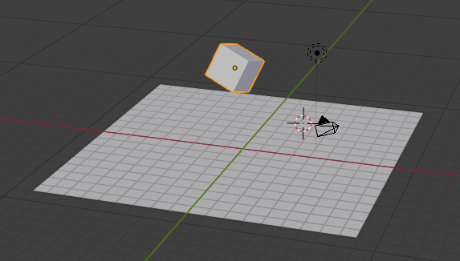

# testPage

- [testPage](#testpage)
  - [ページ作成テストです](#%E3%83%9A%E3%83%BC%E3%82%B8%E4%BD%9C%E6%88%90%E3%83%86%E3%82%B9%E3%83%88%E3%81%A7%E3%81%99)## ページ作成テストです

aaa  
bbb

```
中にコメントを作成
```

1. a
2. b
3. c
4.



画像の挿入テスト。
test
newline

```python

```
